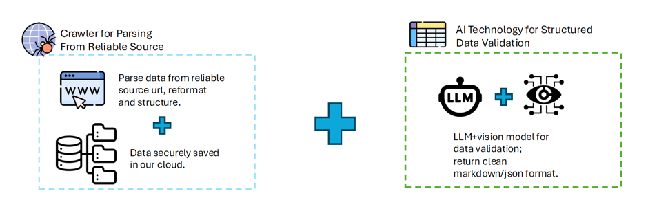

# 🧠 LLM Reasoners for Financial Statement Analysis

**Author:** Xiaoxu (Susie) Li  

**Degree:** MSc in Computer Science, The University of Hong Kong  

**Supervisor:** Prof. Lingpeng Kong 

**Date:** May 2025  

**Repository:** [COMP7704_dissertation](https://github.com/lxx-holmes/COMP7704_dissertation)

---

## 📘 Overview

This dissertation introduces **Value Investing Agents (VIA)** — a **multi-agent, multimodal LLM framework** designed to perform *Buffett-style* financial statement analysis and value investing.  
The system simulates a team of specialized AI analysts who collectively analyze company fundamentals, generate insights, and backtest long-term investment strategies.

> Traditional value investing requires deep reasoning across large volumes of data and qualitative reports.  
> VIA automates this process using **agentic collaboration**, **self-critique loops**, and **cross-source verification**, achieving higher analytical accuracy and depth compared to baselines like *Manus* and *OpenAI Deep Research*.

---

## 🧩 Framework Architecture

VIA is composed of four coordinated AI teams:

<p align="center">
  <br>
  <em>Overall VIA architecture</em>
</p>


1. **Data Specialists Team** – Extracts and verifies 10-K filings and market data using multimodal models.  

<p align="center">
  
</p>
   *Data verification pipeline*


2. **Industry Research Team** – Summarizes sector benchmarks and competitive positioning.  
  
Samples of the industry expert’s output on industrial insights

| Sector | Subsector | Metrics |
|:--------|:-----------|:---------|
| **Technology** | Consumer Electronics | "Unit sales growth", "ASP trends", "Product lifecycle metrics", "Margin by product line", "Innovation pipeline value" |
| **Energy** | Oil & Gas Integrated | "Reserve replacement ratio", "Production growth", "Refining margins", "Break-even oil price", "Carbon intensity metrics" |

  

4. **Analyst Team** – Junior and senior analysts collaborate to analyze company fundamentals over multiple years using five dimensions:
   - Business Strategy  
   - Income Statement Quality  
   - Balance Sheet Quality  
   - Cash Flow Quality  
   - Ratio Analysis  
   *(Figures 5–12: Analytical frameworks and workflows)*

5. **Valuation & Trading Team** – Performs intrinsic valuation (P/E, EV/EBITDA, P/S) and trading backtests.  
   *(Figures 17-1 & 17-2: Example valuation reports for Apple Inc.)*

---

## ⚙️ Methodology

### Agent Collaboration
Agents communicate through **natural language reasoning** and use structured **tool calls** for:
- Web and API searches for live financial data  
- OCR and vision models for parsing tables and charts  
- Quantitative analysis for financial ratios and valuation  

### Self-Critique and Refinement
Each report undergoes iterative **LLM self-review** for:
- **Quantitative accuracy** (data consistency)  
- **Qualitative coherence** (reasoning and narrative flow)  

*(Figures 14-1, 14-2: Example of self-refinement process)*

### Models Used
- **Doubao-Vision-Pro-32k** — multimodal data extraction  
- **DeepSeek-R1** — reasoning and self-critique  
- **ChatGPT-4o** — cross-domain industry insights  
- **Tavily Search Agent** — real-time data retrieval

---

## 📊 Dataset

- 100 U.S. listed companies across **11 industries**  
- 10 years of 10-K filings per company  
- Average token length per document: ~123k  
- Enables long-context reasoning and document understanding research  

*(Figures 1 & 2: Industry coverage and token distribution)*

---

## 🔍 Evaluation

### Baseline Comparisons
| Model | Strengths | Weaknesses |
|--------|------------|------------|
| **Manus** | Structured summaries | Shallow reasoning depth |
| **OpenAI Deep Research** | Strong narrative | Low factual consistency |
| **VIA** | Accurate, coherent, verifiable | Higher compute cost |

*(Figures 18–22: Side-by-side comparison with baseline systems)*

### Trading Performance
- Initial capital: \$1,000,000  
- Duration: 2020–2025  
- Outperformed Buy-and-Hold, MACD, and Mean-Reversion strategies  
- Generated **positive alpha** with realistic risk-adjusted returns  

*(Figures 20–22: Portfolio backtest and P&L visualization)*

---

## 🧠 Key Innovations

| Challenge | VIA Solution |
|------------|--------------|
| Long-context document analysis | Recursive extraction and summarization |
| Analytical reasoning | Chain-of-thought with reinforcement refinement |
| Multimodal data fusion | Vision + text table parsing |
| Benchmarking | 10-year backtest and valuation comparison |
| Transparency | Traceable citation of 10-K source data |

---

## 🚀 Future Work

- Expand to real-time portfolio management and dynamic market data streams  
- Implement long-term **LLM memory persistence**  
- Extend dataset to global markets (EU, HK, CN)  
- Integrate hybrid **LLM + quantitative models** for alpha generation  

---

## 📎 Appendix

- **Appendix I:** Prompt engineering templates  
- **Appendix II:** Self-critique examples *(Figures 15–16)*  
- **Appendix III:** Sample input and output data  
- **Appendix IV:** Generated analysis reports  
- **Appendix V:** Dataset and system access links  

---

## 🖼️ Figure Reference Summary

| Section | Figure(s) | Description |
|----------|------------|-------------|
| Dataset | **Fig. 1–2** | Industry coverage and token length distribution |
| Framework | **Fig. 3–4** | VIA architecture and data pipeline |
| Analyst Team | **Fig. 5–12** | Analytical framework and modules |
| Self-Critique | **Fig. 14–16** | LLM refinement process |
| Valuation | **Fig. 17–1, 17–2** | AAPL valuation example |
| Baseline Comparison | **Fig. 18–22** | VIA vs baseline results |

---

## 📚 Citation

If you use or reference this work:

```bibtex
@mastersthesis{li2025LLMReasoners,
  author    = {Li, Xiaoxu (Susie)},
  title     = {LLM Reasoners for Financial Statement Analysis},
  school    = {The University of Hong Kong},
  year      = {2025},
  advisor   = {Prof. Lingpeng Kong}
}
