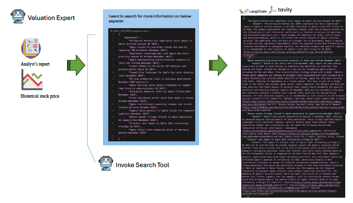
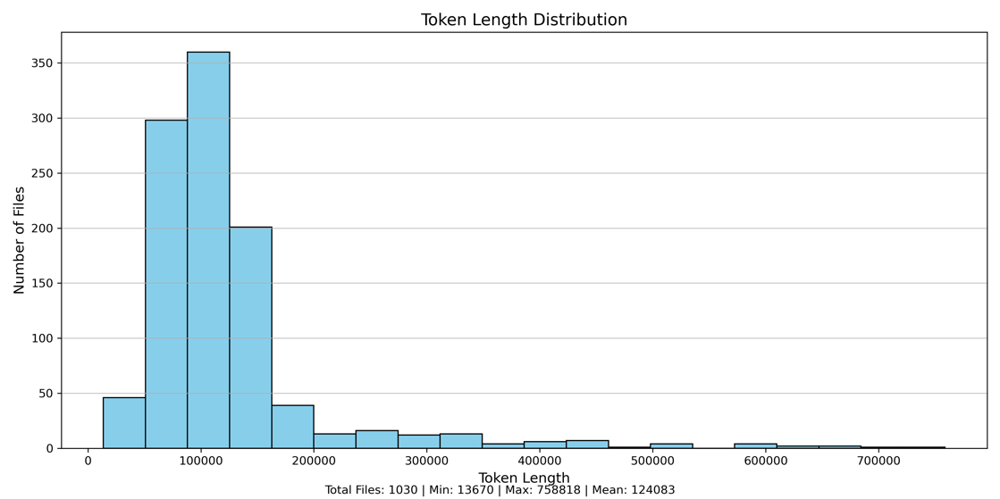

# 🧠 LLM Reasoners for Financial Statement Analysis

**Author:** Xiaoxu (Susie) Li  

**Degree:** MSc in Computer Science, The University of Hong Kong  

**Supervisor:** Prof. L. Kong 

**Date:** May 2025  

**Repository:** [COMP7704_dissertation](https://github.com/lxx-holmes/COMP7704_dissertation)

---

## 📘 Overview

This dissertation introduces **Value Investing Agents (VIA)** — a **multi-agent, multimodal LLM framework** designed to perform *Buffett-style* financial statement analysis and value investing.  
The system simulates a team of specialized AI analysts who collectively analyze company fundamentals, generate insights, and backtest long-term investment strategies.

> Traditional value investing requires deep reasoning across large volumes of data and qualitative reports.  
> VIA automates this process using **agentic collaboration**, **self-critique loops**, and **cross-source verification**, achieving higher analytical accuracy and depth compared to baselines like *Manus* and *OpenAI Deep Research*.

---

## 🧩 Framework Architecture

VIA is composed of four coordinated AI teams:

<p align="center">
  <br>
  <em>Overall VIA architecture</em>
</p>


1. **Data Specialists Team** – Extracts and verifies 10-K filings and market data using multimodal models.  

<p align="center">
  <br>
  <em>Data verification pipeline</em>
</p>

2. **Industry Research Team** – Summarizes sector benchmarks and competitive positioning.  
  
Samples of the industry expert’s output on industrial insights

| Sector | Subsector | Metrics |
|:--------|:-----------|:---------|
| **Technology** | Consumer Electronics | "Unit sales growth", "ASP trends", "Product lifecycle metrics", "Margin by product line", "Innovation pipeline value" |
| **Energy** | Oil & Gas Integrated | "Reserve replacement ratio", "Production growth", "Refining margins", "Break-even oil price", "Carbon intensity metrics" |
  

3. **Analyst Team** – Junior and senior analysts collaborate to analyze company fundamentals over multiple years using five dimensions:
   - Business Strategy  
   - Income Statement Quality  
   - Balance Sheet Quality  
   - Cash Flow Quality  
   - Ratio Analysis

 <p align="center">
  <br>
  <em>Junior analyst workflow</em>
</p>

<p align="center">
  <br>
  <em>Senior analyst workflow</em>
</p>


4. **Valuation & Trading Team** – Performs intrinsic valuation (P/E, EV/EBITDA, P/S) and trading backtests.

The **Valuation Specialist** is responsible for determining a stock’s intrinsic value and setting appropriate safety margins for trading decisions.

> ## Valuation Report of AAPL  
> **Date:** 2023-11-03 (FY2023 Q4 Results)  
> 
> ---
> **Intrinsic Value Per Share:** $160  
> **Safety Margin:** 15%  
> **Upper Bound:** 30%  
> ---
> 
> ### Valuation Analysis  
> Apple’s stock continued to climb in 2023, reaching about $175/share in early November despite FY2023 seeing a small revenue and profit dip (the first annual sales decline since 2019). This pushed Apple’s trailing P/E to roughly 27–28×. Investors treated Apple as a safe haven tech stock – it traded at a 35% P/E premium over the S&P 500 and ~22% over median tech peers by late 2023. The valuation implied confidence that Apple’s ecosystem momentum would offset the temporary hardware slump.  
> 
> Our intrinsic valuation balances Apple’s strong moat with the reality of flat-to-declining FY2023 earnings:
> 
> • **P/E:** We apply **25×** to FY2023 EPS (**$6.15**), a slight contraction from the market’s 27–28×, to reflect the growth slowdown. This gives an intrinsic value of roughly **$155/share**. The 25× multiple is still above the market’s long-term average, but reasonable given Apple’s superior ROIC (~39% vs ~14% sector) and anticipation of new product cycles (e.g., Vision Pro AR headset).  
> 
> • **EV/EBITDA:** Apple’s EV/EBITDA around this time was in the low-20s. We choose ~**18×** for intrinsic value, yielding a similar **$150–$160** range. Notably, Apple’s EV/EBITDA was about a 12% discount to Microsoft’s in 2023 (Apple ~19× vs MSFT ~22×) but well above Meta’s 12×, reflecting Apple’s steadier profile.  
> 
> • **P/S:** Around **7× sales** (with ~$383 B revenue), Apple’s P/S remained between hardware and software norms. Given stable margins, this again points to a value in the mid-$150s (since 5× would be too low and 10× too high for Apple’s mix).  
> 
> ---
> **DDM Check:** Dividend ≈ $0.95 (yield 0.55%). Even with an optimistic growth outlook, the DDM value ($45–$50) is only a fraction of the stock price – a reminder that investors in 2023 were focused on Apple’s total cash return (dividends + big buybacks) and future growth, not just the dividend stream. Apple returned an enormous ~$90 B via buybacks in FY2023, shrinking share count ~4% and buoying EPS despite flat net income.  
> 
> Our intrinsic value estimate for late 2023 is about **$160/share**. The stock at $175+ appeared somewhat overvalued (~10% above intrinsic). The market’s optimism (Apple +28% YTD vs +18% Nasdaq by Nov 2023) was “pricing in” perfect execution of Apple’s next moves (continued services growth and a successful Vision Pro launch). Any hiccup in those expectations meant the intrinsic value would lag the market price.  
> 
> *A sample valuation report of AAPL after Nov 2023’s annual report release.*

<p align="center">
  <br>
  <em>The valuation expert workflow</em>
</p>

The **Portfolio Manager** makes investment decisions based on the Valuation Specialist’s assessments. It will:

• Buy when the stock price falls below:

intrinsic value × (1 − downside safety margin)

• Sell when the stock price rises above:

intrinsic value × (1 + upside safety margin)

If a buy condition hasn’t been triggered, or after a sell if no new buy condition is met, the Portfolio Manager holds cash, earning a 4% risk-free interest rate.
---

## ⚙️ Methodology

### Agent Collaboration
Agents communicate through **natural language reasoning** and use structured **tool calls** for:
- Web and API searches for live financial data  
- OCR and vision models for parsing tables and charts  
- Quantitative analysis for financial ratios and valuation  

### Self-Critique and Refinement
Each report undergoes iterative **LLM self-review** for:
- **Quantitative accuracy** (data consistency)  
- **Qualitative coherence** (reasoning and narrative flow)  

<p align="center">
  <br>
  <em>The self-critique and self-refinement process</em>
</p>

<p align="center">
  <br>
  <em>The LLM self-critique, self-refinement, self-judge loop</em>
</p>


### Models Used
- **Doubao-Vision-Pro-32k** — multimodal data extraction  
- **DeepSeek-R1** — reasoning and self-critique  
- **ChatGPT-4o** — cross-domain industry insights  
- **Tavily Search Agent** — real-time data retrieval

---

## 📊 Dataset

- 100 U.S. listed companies across **11 industries**  
- 10 years of 10-K filings per company  
- Average token length per document: ~123k  
- Enables long-context reasoning and document understanding research  

<p align="center">
  <br>
  <em>Industries of companies covered</em>
</p>

<p align="center">
  <br>
  <em>Distribution of token lengths of the 10-K filings</em>
</p>

---

## 🔍 Evaluation

### Baseline Comparisons
| Model | Strengths | Weaknesses |
|--------|------------|------------|
| **Manus** | Structured summaries | Shallow reasoning depth |
| **OpenAI Deep Research** | Strong narrative | Low factual consistency |
| **VIA** | Accurate, coherent, verifiable | Higher compute cost |


### Trading Performance
- Initial capital: \$1,000,000  
- Duration: 2020–2025  
- Outperformed Buy-and-Hold, MACD, and Mean-Reversion strategies  
- Generated **positive alpha** with realistic risk-adjusted returns  

*(Figures 20–22: Portfolio backtest and P&L visualization)*

---

## 🧠 Key Innovations

| Challenge | VIA Solution |
|------------|--------------|
| Long-context document analysis | Recursive extraction and summarization |
| Analytical reasoning | Chain-of-thought with reinforcement refinement |
| Multimodal data fusion | Vision + text table parsing |
| Benchmarking | 10-year backtest and valuation comparison |
| Transparency | Traceable citation of 10-K source data |

---

## 🚀 Future Work

- Expand to real-time portfolio management and dynamic market data streams  
- Implement long-term **LLM memory persistence**  
- Extend dataset to global markets (EU, HK, CN)  
- Integrate hybrid **LLM + quantitative models** for alpha generation  

---

## 📎 Appendix

- **Appendix I:** Prompt engineering templates  
- **Appendix II:** Self-critique examples *(Figures 15–16)*  
- **Appendix III:** Sample input and output data  
- **Appendix IV:** Generated analysis reports  
- **Appendix V:** Dataset and system access links  

---

## 🖼️ Figure Reference Summary

| Section | Figure(s) | Description |
|----------|------------|-------------|
| Dataset | **Fig. 1–2** | Industry coverage and token length distribution |
| Framework | **Fig. 3–4** | VIA architecture and data pipeline |
| Analyst Team | **Fig. 5–12** | Analytical framework and modules |
| Self-Critique | **Fig. 14–16** | LLM refinement process |
| Valuation | **Fig. 17–1, 17–2** | AAPL valuation example |
| Baseline Comparison | **Fig. 18–22** | VIA vs baseline results |

---

## 📚 Citation

If you use or reference this work:

```bibtex
@mastersthesis{li2025LLMReasoners,
  author    = {Li, Xiaoxu (Susie)},
  title     = {LLM Reasoners for Financial Statement Analysis},
  school    = {The University of Hong Kong},
  year      = {2025},
  advisor   = {Prof. L. Kong}
}
